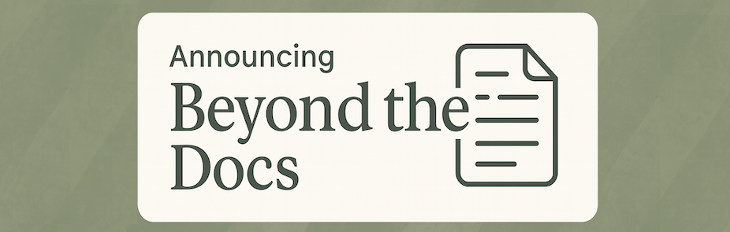

Hi, I’m Jenna, and welcome to _Beyond the Docs_! This is where I go “beyond the docs” to explore everything that surrounds technical writing: capturing knowledge as it happens, structuring information for clarity, improving processes, and embracing emerging tools like AI.

<!-- truncate -->

Drawing on my experience as a technical writer, content strategist, program manager, team leader, and educator, I share thoughts, lessons, and observations for anyone passionate about knowledge management, documentation, and the systems that make information work.

Over the years, I’ve learned that effective knowledge systems are more than just documentation. They’re living frameworks that evolve with your organization and empower content professionals to do their jobs easily and effectively. They also create a lasting impact on customers, stakeholders, and users by enabling self-service and helping them find the information they need quickly. 

Here, you’ll find reflections and insights from my work in knowledge management, PMO transformation, and content strategy, along with lessons learned along the way. I’ll share approaches that help teams build smarter, scale faster, and communicate better, whether through KCS principles, modern documentation practices, or a good old-fashioned playbook.

Thanks for reading, and welcome to _Beyond the Docs_. 

