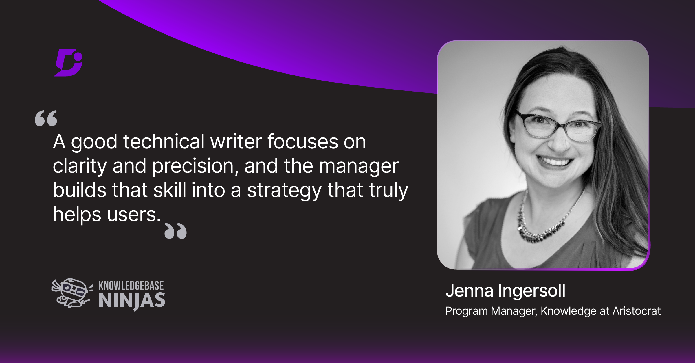

Recently, I had the chance to talk about effective knowledge solutions on the [Knowledgebase Ninjas](https://document360.com/podcast/) podcast from Document360. We dove into the real challenges technical writers face when moving into knowledge management, such as reorganizing scattered content systems, understanding information flow, and building effective documentation frameworks. 

<!-- truncate -->

It was this conversation that reminded me how much I love connecting ideas, systems, and people, and it inspired me to start this blog.

**Listen to the full episode on [Apple](https://podcasts.apple.com/gb/podcast/knowledgebase-ninjas/id1496613504) | [Spotify](https://open.spotify.com/show/6FvQBMNBUhqe4VN2ZVybnj) | [YouTube](https://youtu.be/XwAAI8ReD64)**

