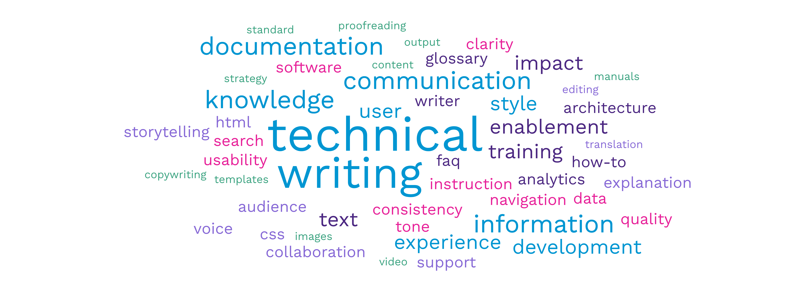

When I tell people that I work in Knowledge Management and Technical Writing, they usually nod and say something like, “Oh, we have technical writers at our company.”

That’s when I smile and say, “It’s not quite what you imagine.”

<!-- truncate -->

My work goes far beyond writing the words on a page. I build the systems behind them. I organize the table of contents. I architect the user journey, refine the visuals, and define the standards that keep everything consistent. I reimagine how users find information, not just how they read it. And along the way, I mentor writers, collaborate across teams, and transform content publishing workflows and culture.

Over the next few articles, I’ll explore what it really means to design a documentation system, one that goes beyond the surface layer of writing. We’ll talk about structure, design, governance, taxonomy, analytics, and all the other elements that transform “documentation” into a true knowledge ecosystem.

Below are the core concepts that shape how great technical writers think, design, and build. Each of these areas deserves its own deep dive, but together they form the foundation of every sustainable documentation strategy.

<div style={{ display: 'none' }} >

## Core Concepts 

</div>

<div style={{ marginLeft: '2em' }} >

---

### Knowledge Ecosystem

The **knowledge ecosystem** is the foundation of any documentation strategy that connects information with people. It’s more than a collection of documents; it’s the interactions between people, data, processes, and tools that work together to create, publish, share, use, and retain knowledge.

A strong knowledge ecosystem ensures that information is accessible, accurate, and continually evolving as an organization grows and learns.

---

### Documentation System

The **documentation system** is the _output_ of a cohesive knowledge ecosystem. It's the complete deliverable that users interact with, along with the environment and tools that produced it. Think of the documentation system as the hands-on version of your knowledge strategy: where content design, structure, and toolchains come together to build an experience your users will interact with.

Documentation systems can take many forms: online help sites, developer portals, internal wikis, knowledge bases, white papers, or interactive tutorials. The format itself isn’t what defines the system; it's how the deliverable was created, maintained, and connected within the broader ecosystem.

---

### Information Architecture

The **information architecture** defines how information is structured, categorized, and connected within a documentation system. Once you know what content you need, information architecture organizes it logically and maps out how topics relate to one another. 

It’s about creating clear navigation, smooth content flow, and intuitive paths that guide users to the information they need. A strong information architecture helps people find the right answer quickly and confidently, without frustration or wasted clicks.

---

### Content Design

The **content design** defines how documentation looks, feels, and functions, shaping the user’s ability to comprehend and retain information. It focuses on both visual and written design, bringing together layout, structure, and language to create a seamless reading experience.

Here, we focus on brand consistency, ensuring that the content aligns with the company’s voice, tone, and style guidelines. We also explore intuitive ways to present information and when visuals or diagrams can make complex topics easier to understand.

Ultimately, content design is about crafting a great user experience through clear writing, thoughtful organization, and purposeful visual design.

---

### Governance

**Governance** is the behind-the-scene framework that defines how documentation is written, reviewed, and maintained. It keeps everyone in the knowledge ecosystem (writers, editors, managers, project teams, and subject matter experts) operating cohesively and aligned with the organization's strategic goals. Governance outlines the "how" of your knowledge ecosystem, including:

- Content request prioritization
- Roles and responsibilities for writing, editing, and publishing
- Writing standards and style guides
- Information lifecycle management
- Toolchains for content creation and delivery
- Metrics and reporting on documentation effectiveness

A strong governance model ensures that content stays consistent, accurate, and sustainable, no matter how large or distributed your teams become.

---

### Taxonomy and Metadata

**Taxonomy** is the practice of organizing and categorizing content based on similarities. It provides the formal structure of documentation, mapping relationships between different pieces of knowledge. The goal is to accurately classify, group, and label information so it's both findable and usable. 

Let's look at an example. In this blog, I tag each post with a set of terms that describe the content, such as:

```technical writing``` ```knowledge management``` ```documentation strategy``` ```information architecture``` ```content design``` ```navigation``` ```toolchains```

These tags appear at the bottom of each post. When you click a tag, the documentation system automatically displays every other post with the same tag, grouping related content together by topic. The taxonomy defines the list of available tags, the structure they fit into, and how they connect related content behind the scenes.

In larger systems, taxonomies often include metadata for search accuracy, hierarchical trees for navigation and breadcrumbs, and logical classifications.

---

### Analytics and Feedback

**Analytics** are the data points that help you understand how your documentation is performing. Metrics like page views, click paths, time on page, and search terms reveal how users engage with your content and where they might be getting stuck. These insights help you prioritize updates, identify content gaps, and make data-informed decisions about what to improve next.

Similarly, **feedback** provides direct input from readers. Surveys, comments, forums, and user requests add context to analytics, backing up the numbers with actionable insights. Together, analytics and feedback create a continuous improvement loop that keeps documentation accurate, relevant, and genuinely useful. 

---

</div>

Each of these concepts plays a part in how we design and maintain great documentation. When they work together, they create a living ecosystem that makes knowledge accessible, adaptable, and built to last.