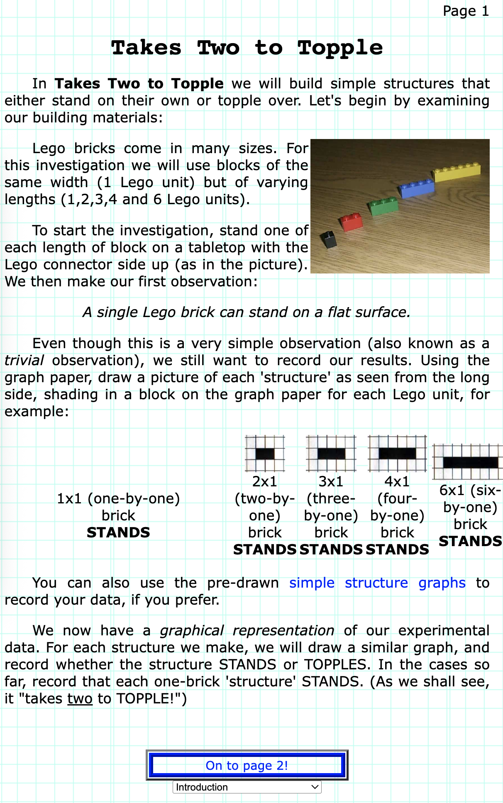

From an early age, I noticed how our senses shape what we remember. Think about your earliest memories. If you write them down, chances are the strongest details aren’t what happened, but how it felt: what you saw, heard, smelled, tasted, or touched.

Here’s mine: I remember drinking from a bright red cup of slightly spoiled milk. I can’t recall when or where it happened (or even who was with me), but I vividly remember the sour taste and that bold red color. Those sensory details have stayed with me long after the moment itself faded.

<!-- truncate -->

The same goes for our documentation systems. What people remember most isn’t just the content - it’s _how_ that content is presented. They notice the site’s structure, the typography (trust me, no one forgets Comic Sans, but not for the right reasons!), and the way the color palette makes them feel. So while clear, accurate, and engaging writing is essential, it’s equally important to design a visually appealing system that creates a sensory experience your audience won’t forget.

    

I’ll always be grateful for my first internship, where "interaction" was stressed in everything we did. We built interactive modeling tools for education, and that’s where I first began developing websites for our curriculum. My very first published lesson (at age 15!) was a static page of text and images, but I figured out how to add a dropdown menu at the bottom to navigate between sections. I even added a background grid to match the topic of the lesson: modeling. Even back then, I understood how deeply the visual experience shapes how people connect with information. 
    
    

    

    

Of course, I’ve learned a lot since I was 15, and my systems have grown more sophisticated. But that early lesson still holds true: visuals matter. So what elements of design should we consider when crafting modern documentation systems?

- **Flow**: Humans naturally read left to right and top to bottom. Use this instinct to your advantage: place your logo in the top-left corner to brand your content, and arrange elements left-to-right in order of importance. Less critical content can live lower on the page, like the footer.
- **Size**: Larger elements draw attention, so use that to emphasize what matters most. For example, large tiles on your home page can direct users to key categories, while smaller tiles can link to specific topics or articles.
- **Color**: Choose a palette that aligns with your brand and feels cohesive. Contrasting colors help highlight key elements, but balance is everything; too many bright hues can overwhelm the reader and distract from your content. Even a small pop of color in a logo, title, or image can make a big difference.
- **Typography**: Fonts have personality. An outdated or overused font can make your docs feel dated, while clean, complementary typefaces build trust and make reading more enjoyable. Typography is a subtle but powerful cue that tells users how modern and reliable your system feels.
- **Layout**: Alignment creates order. Use grids to keep content organized and easy to follow. A clear structure helps readers navigate intuitively. Tiles might group documentation types, followed by a clean single column for FAQs or detailed content.
- **Composition**: Photographers have mastered composition for decades, and we can use their learnings to our benefit. Apply the Rule of Thirds, Rule of Odds, or Dynamic Movement to guide the reader’s eye naturally through your content.
- **White Space**: White space is your secret superpower. It gives users room to breathe, reduces visual fatigue, and improves readability. Empty space isn’t wasted; instead, it’s what makes the rest of your content stand out.
- **Call to Action (CTAs)**: CTAs (buttons or links) invite interaction. Simple prompts like “Read More” or “View Related Content” help readers stay engaged and discover more within your system.
- **Images and other Visuals**: Images, icons, and graphics break up text, add visual rhythm, and reinforce meaning. Use visuals strategically, connecting them to key concepts or highlighting important notes or actions.

When these visual principles come together, your documentation doesn’t just inform. It engages, invites, and empowers the reader. A well-designed system helps users absorb information more easily and gives them a reason to come back again and again.