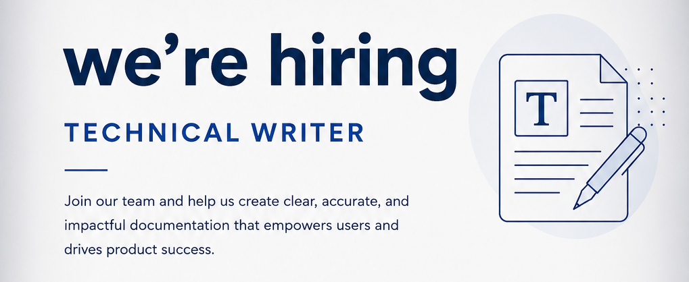

Layoffs. It's the word nobody wants to hear, but it's been a constant in the tech industry for the past few years. And with layoffs comes the job search, which means wading through hundreds of job ads, trying to figure out exactly what each company is actually looking for.

If you've recently searched for a technical writing job, you know the whiplash of scanning hundreds of postings with wildly different titles, requirements, and expectations. Documentation Specialist. Knowledge Strategist. Programmer Writer. Information Engineer. What does any of that mean, and which ones are actually in your wheelhouse?

<!-- truncate -->

So here's my attempt to make sense of it all: a guide to the technical writing titles you'll actually see out there, and what you need to know before hitting apply.

## Writing Roles

### Technical Writer (Jr, I, II)
**Overlaps with** Technical Content Writer, Documentation Specialist, Content Developer

_Creates and maintains foundational documentation such as user guides, FAQs, and how-to articles under guidance from senior writers or a documentation lead._

**Year of Experience**: 0-3 years **Type of Role**: Individual Contributor **Typically Reports to**: Engineering, Product, or Documentation team lead **Common Industries**: Software & IT, Healthcare, Finance, Government, Manufacturing

**Primary Skills**: 

- Writing & editing 
- Microsoft Word | Google Docs
- Basic HTML or Markdown
- Research & interviewing SMEs
- Attention to detail

**Red Flags**: Entry-level titles are sometimes used for mid-level work to keep salaries lower. Some postings expect familiarity with docs-as-code tools, DITA, or even light programming that's unrealistic for a true junior hire.

### Technical Writer (Sr / Lead / Staff / Principal)
**Overlaps with**: Documentation Architect, Programmer Writer, Documentation Engineer, Technical Product Content Lead

_Owns complex, high-impact documentation projects independently; often sets standards and mentors others without holding a formal management role._

**Years of Experience**: 5–12+   **Type of Role**: Individual Contributor   **Typically Reports to**: Engineering Manager, Documentation Manager, or VP of Product   **Common Industries**: Software & IT, AI/ML, Finance, Healthcare, Semiconductors

**Primary Skills**
* Advanced writing & editing
* Docs-as-code (Git, Markdown, SSGs)
* API / developer documentation
* Stakeholder management
* Taxonomy & content strategy

**Red Flags**: Principal and Staff titles may expect near-engineering-level skills: debugging code, contributing to repos, or owning toolchain decisions. "Lead" sometimes implies direct reports without manager pay — clarify before accepting.

### Founding Technical Writer
**Overlaps with**: Documentation Lead, Technical Product Content Lead, Documentation Engineer

_First dedicated documentation hire at an early-stage company, responsible for building the entire documentation system, toolchain, and standards from scratch._

**Years of Experience**: 5–10   **Type of Role**: Individual Contributor   **Typically Reports to**: VP of Engineering, CTO, or Head of Product (often no documentation chain above you)   **Common Industries**: Startups (SaaS, AI/ML, fintech, dev tools)

**Primary Skills**
* Docs-as-code tooling
* Content strategy
* Self-direction
* Cross-functional collaboration
* API / developer docs

**Red Flags**: Often scoped as Individual Contributor pay for what is effectively a manager's workload — you may be building the team, the toolchain, the taxonomy, and still writing full-time. Clarify growth expectations and headcount plans upfront.

### Technical Content Writer
**Overlaps with**: Technical Writer, Technical Marketing Writer, Technical Docs Writer

_Produces content that explains technical products or concepts, often bridging deep technical documentation and broader audience-friendly content such as tutorials, blogs, or whitepapers._

**Years of Experience**: 3–6   **Type of Role**: Individual Contributor   **Typically Reports to**: Marketing, Developer Relations, or Product   **Common Industries**: SaaS, Developer tools, Cybersecurity, AI/ML, Cloud

**Primary Skills**
* Technical writing
* SEO fundamentals
* Developer empathy
* Research
* Markdown / CMS tools

**Red Flags**: May report into Marketing rather than Engineering, shifting expectations toward lead generation and SEO metrics instead of documentation quality. Scope and audience vary widely — the same title can mean API docs at one company and blog posts at another.

### Technical Docs Writer
**Overlaps with**: Technical Writer, Programmer Writer, Documentation Engineer

_Focuses specifically on product or API documentation, typically developer-facing; effectively a clearer synonym for technical writer in many postings._

**Years of Experience**: 3–7   **Type of Role**: Individual Contributor   **Typically Reports to**: Engineering Manager or Head of Developer Experience   **Common Industries**: Software, Developer tools, Cloud platforms, Open source

**Primary Skills**
* API documentation
* Markdown / OpenAPI / Swagger
* Git
* Structured writing
* Developer workflows

**Red Flags**: Title is often used interchangeably with Technical Writer. If the JD includes "developer" heavily, expect a higher coding bar than the title implies — sometimes approaching Programmer Writer territory.

### Writer
**Overlaps with**: Technical Content Writer, Technical Marketing Writer, Content Developer

_A broad title that may encompass technical, marketing, or general content writing; context and industry determine the actual scope of work._

**Years of Experience**: 2–6   **Type of Role**: Individual Contributor   **Typically Reports to**: Marketing, Product, or Engineering depending on content focus   **Common Industries**: Technology, Media, Agencies, SaaS

**Primary Skills**
* Writing & editing
* Content organization
* Research
* Adaptability across formats

**Red Flags**: "Writer" in a tech company is often a technical writer role in practice, but posted with a vague title to attract a wider pool or to justify a lower salary band. Always read the full JD before assuming it's not a fit.

### Content Developer
**Overlaps with**: Technical Writer, Instructional Designer, Knowledge Specialist

_Creates structured content — documentation, training materials, or help articles — often with an emphasis on instructional design principles or structured authoring._

**Years of Experience**: 2–6   **Type of Role**: Individual Contributor   **Typically Reports to**: L&D Manager, Documentation Manager, or Head of Product Education   **Common Industries**: Healthcare, Software, Education, Financial services, Government

**Primary Skills**
* Content authoring tools (MadCap Flare, Confluence, Notion)
* Structured writing
* Research
* Visual content basics
* Editing

**Red Flags**: In some companies this is an L&D title; in others it's a synonym for technical writer. Without reading the JD carefully, you may apply for a training developer role expecting a docs role, or vice versa. Alternatively, this role may be expected to develop other types of assets, including visual artifacts, videos, or style sheets.

### Information Developer
**Overlaps with**: Technical Writer, Documentation Architect, Publications Engineer

_Creates structured technical information products — documentation, help systems, and knowledge bases — often using DITA or XML-based authoring tools._

**Years of Experience**: 3–8   **Type of Role**: Individual Contributor   **Typically Reports to**: Documentation Manager or Information Architecture lead   **Common Industries**: Enterprise software, Telecommunications, Aerospace, IBM ecosystem

**Primary Skills**
* DITA / XML
* Structured authoring tools (Oxygen XML, Arbortext)
* Information architecture
* Technical writing
* Publishing workflows

**Red Flags**: Title is more common in enterprise and legacy tech companies (IBM origin). If the posting doesn't mention DITA or structured authoring, verify whether they actually mean a standard technical writer role.

### Publications Engineer
**Overlaps with**: Technical Manual Developer, Information Developer, Documentation Control Manager

_Produces and publishes technical documentation, such as hardware manuals, maintenance procedures, or regulatory submissions, with an emphasis on production quality and publishing workflows._

**Years of Experience**: 4–10   **Type of Role**: Individual Contributor   **Typically Reports to**: Publications Manager or Chief Engineer   **Common Industries**: Aerospace & Defense, Manufacturing, Medical devices, Government

**Primary Skills**
* FrameMaker / MadCap Flare
* Technical writing
* Publishing pipelines
* Illustration / diagramming
* Regulatory formatting

**Red Flags**: Common in hardware, aerospace, and defense where documents must meet strict standards (S1000D, ATA). If you come from a software documentation background, the tooling and formatting expectations here are substantially different.

---

## Editing Roles

### Technical Editor
**Overlaps with**: Technical Writer, Documentation Specialist, Publications Engineer

_Reviews and refines technical documentation produced by writers, engineers, or SMEs to ensure accuracy, consistency, clarity, and adherence to style guides._

**Years of Experience**: 3–7   **Type of Role**: Individual Contributor   **Typically Reports to**: Documentation Manager, Managing Editor, or Director of Content   **Common Industries**: Software, Publishing, Government, Aerospace & Defense, Healthcare

**Primary Skills**
* Copyediting & proofreading
* Style guide expertise (Chicago, Microsoft, custom)
* Subject matter comprehension
* Feedback delivery
* Content management tools

**Red Flags**: Some postings blur editor and writer responsibilities without adjusting the title or pay. Others expect the editor to own and maintain the style guide unilaterally. This is rarely a standalone role in smaller orgs; editors are often quietly expected to write too.

---

## Knowledge Management Roles

### Knowledge Specialist
**Overlaps with**: Knowledge Manager, Content Developer, Documentation Specialist, Help Center Manager

_Creates, organizes, and maintains content in a knowledge base or wiki, ensuring information is accurate, structured, and easy to find for internal teams or customers._

**Years of Experience**: 2–6   **Type of Role**: Individual Contributor   **Typically Reports to**: Knowledge Manager, Director of Support Operations, or Customer Success lead   **Common Industries**: Customer support / BPO, SaaS, Financial services, Healthcare, Retail

**Primary Skills**
* Knowledge base management
* Writing & editing
* Content organization
* CMS tools (Confluence, Notion, Guru)
* Collaboration

**Red Flags**: May be closer to a content editor or curator than a writer. Often focused on internal knowledge (support, CS, ops) rather than external-facing product docs. Success metrics tend to be operational (ticket deflection, search hit rate) rather than documentation quality.

### Knowledge Strategist
**Overlaps with**: Knowledge Manager, Content Strategist, Documentation Architect, Manager Knowledge Management

_Defines the long-term vision and governance for an organization's knowledge management program, including standards, platforms, taxonomies, and measurement frameworks._

**Years of Experience**: 7–14   **Type of Role**: Individual Contributor / Leadership   **Typically Reports to**: Chief Knowledge Officer, VP of Operations, or Chief of Staff   **Common Industries**: Financial services, SaaS, BPO / customer operations, Healthcare, Enterprise software

**Primary Skills**
* KM strategy
* Governance design
* Change management
* Content lifecycle
* Analytics

**Red Flags**: Senior and often leadership-adjacent; this role may be an Individual Contributor or people manager depending on org size. Focus is on program design rather than hands-on writing, which can be a frustrating mismatch if you want to stay close to content.

### Manager, Knowledge Management
**Overlaps with**: Knowledge Strategist, Help Center Manager, Documentation Manager

_Leads a KM team and program, owning knowledge base strategy, governance, tooling, and the content lifecycle for internal or external knowledge assets._

**Years of Experience**: 8–14   **Type of Role**: Management   **Typically Reports to**: VP of Customer Success, Chief People Officer, or VP of Operations   **Common Industries**: Financial services, SaaS, BPO, Healthcare, Enterprise software

**Primary Skills**
* KM strategy & governance
* People management
* Knowledge base platforms
* Analytics
* Change management

**Red Flags**: May focus on internal employee knowledge (HR, IT, ops) or customer-facing support content or both. Verify audience and platform before applying; the day-to-day is very different across these contexts.

---

## Instructional Design Roles

### Manager, Learning and Content
**Overlaps with**: Documentation Manager, Instructional Designer, Manager Knowledge Management

_Leads a combined team responsible for both instructional content (eLearning, training) and documentation or knowledge base content, often for internal audiences._

**Years of Experience**: 8–14   **Type of Role**: Management   **Typically Reports to**: Chief People Officer, VP of Enablement, or VP of Customer Education   **Common Industries**: Enterprise software, Financial services, Healthcare, Retail, Manufacturing

**Primary Skills**
* People management
* Instructional design
* Content strategy
* LMS administration
* Cross-functional alignment

**Red Flags**: Blends L&D and documentation management and requires fluency in both worlds. If you come from a pure documentation background without L&D exposure, the training program ownership may be a bigger lift than the JD implies.

---

## Communications Roles

### Communications Development Manager
**Overlaps with**: Technical Communications Manager, Documentation Program Manager, Content Manager

_Leads development of communications programs, toolkits, and content (often internally facing) ensuring teams have the messaging and documentation they need to operate effectively._

**Years of Experience**: 8–14   **Type of Role**: Management   **Typically Reports to**: Chief People Officer, CIO, or VP of Internal Communications   **Common Industries**: Enterprise IT, Financial services, Government, Healthcare, Manufacturing

**Primary Skills**
* Communications strategy
* People management
* Writing & editing
* Program development
* Stakeholder management

**Red Flags**: Can be an HR, IT, or product-adjacent role depending on org. The "development" framing may mean building new programs from scratch, not managing existing content teams. Be sure to verify whether this is a startup-mode build or a steady-state management role.

### Technical Communicator
**Overlaps with**: Technical Writer, Instructional Designer, Content Developer

_A broad umbrella title for professionals who communicate technical information across formats, such as documents, videos, infographics, training, and various audiences._

**Years of Experience**: 3–10   **Type of Role**: Individual Contributor   **Typically Reports to**: Director of Communications, Documentation Manager, or Head of Product Education   **Common Industries**: Software, Aerospace, Healthcare, Government, Education

**Primary Skills**
* Writing & editing
* Visual communication
* Audience analysis
* Multiple content formats
* Collaboration with SMEs

**Red Flags**: Implies a wider format range than a traditional technical writer, which may include video scripting, eLearning, or visual design. If you don't have those skills, verify which formats are actually required vs. nice-to-have.

### Technology Communications Specialist
**Overlaps with**: Technical Communicator, Technical Writer, Policy Writer

_Communicates technical information to internal or external audiences, often bridging IT/engineering and non-technical business stakeholders._

**Years of Experience**: 3–7   **Type of Role**: Individual Contributor   **Typically Reports to**: CIO, Head of IT, or Director of Internal Communications   **Common Industries**: Enterprise IT, Government, Healthcare, Financial services

**Primary Skills**
* Technical writing
* Business communication
* Presentation design
* Stakeholder management
* Plain language

**Red Flags**: May be more communications or PR-adjacent than traditional documentation. Sometimes sits in IT rather than a product org, which changes the subject matter, audience, and tooling significantly.

---

##  Operations Roles

### Documentation Program Manager
**Overlaps with**: Documentation Manager, Technical Product Content Lead, Knowledge Strategist

_Manages the processes, tools, and delivery of a documentation program across multiple teams or product lines, often without direct people management._

**Years of Experience**: 8–14   **Type of Role**: Management   **Typically Reports to**: VP of Engineering, Head of Program Management, or Director of Documentation   **Common Industries**: Cloud, SaaS, AI/ML, Enterprise software, Government

**Primary Skills**
* Program management
* Documentation strategy
* Toolchain administration
* Cross-functional coordination
* Metrics & reporting

**Red Flags**: May or may not include direct reports; this is often a senior Individual Contributor or TPM-adjacent role. Focus is on systems and delivery rather than content creation, which can be a mismatch if you want to stay close to writing.

### Content Manager
**Overlaps with**: Help Center Manager, Knowledge Manager, Documentation Manager, Content Strategist

_Oversees a body of content — documentation, marketing materials, or help center articles — managing editorial calendars, content quality, and sometimes a small team of writers or contractors._

**Years of Experience**: 4–8   **Type of Role**: Individual Contributor / Leadership   **Typically Reports to**: VP of Marketing, Head of Product, or Director of Content   **Common Industries**: SaaS, E-commerce, Media, Healthcare, Fintech

**Primary Skills**
* Content strategy
* Editorial planning
* CMS proficiency
* Cross-functional collaboration
* Analytics / content performance

**Red Flags**: When this title appears under Engineering or Product it often means documentation management. Under Marketing it's almost always a content marketing role. The same title can mean very different work. Be sure to verify the reporting chain.

### Documentation Control Manager
**Overlaps with**: Documentation Specialist, Publications Manager, Policy Writer

_Manages the lifecycle, version control, and compliance of documentation in regulated industries, ensuring records meet audit and regulatory standards._

**Years of Experience**: 6–12   **Type of Role**: Individual Contributor / Leadership   **Typically Reports to**: Quality Assurance Director, Compliance Officer, or VP of Regulatory Affairs   **Common Industries**: Pharmaceuticals, Biotech, Aerospace & Defense, Medical devices, Manufacturing

**Primary Skills**
* Document control systems (Veeva, Documentum, SharePoint)
* Regulatory compliance
* Version control
* SOPs
* Change management

**Red Flags**: Very different from a software documentation role; this is primarily a compliance and records management position. Applying without regulated-industry experience (FDA, ISO, GxP) is a significant mismatch that may not be obvious from the title alone.

### Documentation Specialist
**Overlaps with**: Documentation Control Manager, Technical Writer, Policy Writer

_Creates, organizes, and maintains documentation assets for internal or external audiences, often with an emphasis on process documentation or regulated-industry compliance._

**Years of Experience**: 2–5   **Type of Role**: Individual Contributor   **Typically Reports to**: Quality Manager, Compliance Officer, or Operations Manager   **Common Industries**: Pharmaceuticals, Manufacturing, Healthcare, Government, Finance

**Primary Skills**
* Writing & editing
* Document control systems
* File management
* Attention to detail
* Compliance awareness

**Red Flags**: Common in regulated industries where the role is heavily process-driven (SOPs, QA docs, compliance records) rather than developer or product documentation. If you're a software TW, verify the domain before applying, as these can be very different jobs.

### Content Library Operations Manager
**Overlaps with**: Documentation Program Manager, Manager Knowledge Management, Director of Content Strategy

_Oversees the operational management of a large content library — governance, metadata standards, publishing workflows, and team performance — at scale._

**Years of Experience**: 10–16   **Type of Role**: Management   **Typically Reports to**: VP of Marketing Operations, Chief Content Officer, or VP of Customer Experience   **Common Industries**: Financial services, Insurance, Healthcare, Enterprise software, Retail

**Primary Skills**
* Content operations
* People management
* Taxonomy & metadata
* Workflow automation
* Cross-functional leadership

**Red Flags**: Operations-heavy role that may include vendor and contractor management, toolchain ownership, and procurement. If you're expecting a documentation leadership role with significant writing involvement, this may skew more toward program and process management.

---

## Systems Roles

### Documentation Architect
**Overlaps with**: Principal Technical Writer, Information Developer, Documentation Engineer, Knowledge Strategist

_Designs the high-level structure, taxonomy, and information architecture of a documentation ecosystem, ensuring content is findable, scalable, and consistent across product lines._

**Years of Experience**: 8–15   **Type of Role**: Individual Contributor   **Typically Reports to**: VP of Engineering, Director of Documentation, or Chief Architect   **Common Industries**: Enterprise software, Cloud, Semiconductors, Telecommunications

**Primary Skills**
* Information architecture
* Taxonomy & metadata
* Content modeling
* Docs-as-code tooling
* Cross-functional leadership

**Red Flags**: Rare as a standalone title; this role is often a senior TW or principal writer with architecture responsibilities added on. May require DITA or structured content system expertise that isn't always flagged clearly in the JD.

### Documentation Engineer
**Overlaps with**: Programmer Writer, Technical Docs Writer, Documentation Architect

_Sits at the intersection of software engineering and technical writing, building and maintaining documentation toolchains, CI/CD pipelines for docs, and contributing code alongside documentation._

**Years of Experience**: 5–10   **Type of Role**: Individual Contributor   **Typically Reports to**: Engineering Manager or VP of Engineering   **Common Industries**: Developer tools, Cloud, Open source, AI/ML, Fintech

**Primary Skills**
* Software development (Python, JS, etc.)
* Static site generators (Docusaurus, Sphinx, Hugo)
* CI/CD pipelines
* Git
* API documentation

**Red Flags**: Closer to a software engineer than a traditional writer — expect the coding bar to be real, including code samples in interviews. Some postings require a CS degree. If you're a writer who codes a little, this title may be out of scope.

---

## Leadership Roles

### Director of Content Strategy
**Overlaps with**: Documentation Manager, Knowledge Strategist, Technical Communications Manager

_Sets organizational direction for all content, including documentation, marketing, product content, and UX writing, while often leading multiple teams and reporting to a VP or C-suite executive._

**Years of Experience**: 12–18   **Type of Role**: Management   **Typically Reports to**: CMO, Chief Product Officer, or CEO at smaller companies   **Common Industries**: SaaS, E-commerce, Media, Enterprise software, Healthcare

**Primary Skills**
* Content strategy
* People management
* Executive stakeholder management
* Budgeting
* Cross-org alignment

**Red Flags**: Scope varies enormously. In some companies this is a marketing leadership role; in others it includes technical documentation. Verify which content domains are in scope; some postings use "content strategy" to mean marketing content exclusively.

### Technical Writing Manager
**Overlaps with**: Documentation Manager, Documentation Lead, Technical Product Content Lead

_Leads a team of technical writers, managing hiring, performance, career development, and documentation quality across a product area or organization._

**Years of Experience**: 8–14   **Type of Role**: Management   **Typically Reports to**: VP of Engineering, VP of Product, or Director of Documentation   **Common Industries**: Software, Cloud, AI/ML, Healthcare, Financial services

**Primary Skills**
* People management
* Documentation strategy
* Cross-functional leadership
* Hiring & performance review
* Technical writing background

**Red Flags**: Scope ranges from managing 2 writers to 20+. Some postings expect the manager to remain hands-on as a writer; others are purely people-focused. Individual Contributor-to-manager transitions often happen here without adequate support or manager training.

### Documentation Manager
**Overlaps with**: Technical Writing Manager, Documentation Program Manager, Technical Product Content Lead

_Manages a documentation team and owns the documentation program strategy, tooling decisions, and cross-functional relationships with product and engineering._

**Years of Experience**: 8–14   **Type of Role**: Management   **Typically Reports to**: VP of Engineering, CTO, or Director of Product   **Common Industries**: Enterprise software, Cloud, SaaS, Government, Semiconductors

**Primary Skills**
* People management
* Documentation program strategy
* Toolchain & platform ownership
* Stakeholder alignment
* Content governance

**Red Flags**: Functionally similar to Technical Writing Manager, and the difference is often in emphasis (program vs. people). May also be used for senior Individual Contributor roles without direct reports at smaller companies, so always verify headcount.

### Technical Communications Manager
**Overlaps with**: Documentation Manager, Technical Writing Manager, Director of Content Strategy

_Leads technical communications across formats — documentation, internal comms, product messaging — while managing a cross-functional team of writers and communicators._

**Years of Experience**: 8–14   **Type of Role**: Management   **Typically Reports to**: CMO, VP of Marketing, or VP of Engineering depending on org   **Common Industries**: Aerospace & Defense, Enterprise software, Government, Healthcare, Manufacturing

**Primary Skills**
* People management
* Communications strategy
* Technical writing
* Executive communication
* Cross-functional collaboration

**Red Flags**: Broader than a documentation manager, and may include PR, internal comms, or marketing writing. Scope varies significantly by industry. In some orgs, "communications" means PR and media relations with documentation as a footnote.

### Publications Manager
**Overlaps with**: Documentation Manager, Documentation Control Manager, Technical Communications Manager

_Oversees the production and delivery of technical publications — manuals, catalogs, regulatory submissions — while managing a team of writers, editors, and production staff._

**Years of Experience**: 8–15   **Type of Role**: Management   **Typically Reports to**: Chief Engineer, VP of Operations, or Director of Quality Assurance   **Common Industries**: Aerospace & Defense, Manufacturing, Medical devices, Government, Automotive

**Primary Skills**
* People management
* Publication production workflows
* Regulatory and standards knowledge
* FrameMaker / DITA
* Project management

**Red Flags**: Most common in hardware, aerospace, defense, and regulated industries. More production-focused than a software documentation manager, so if you don't have experience with standards-driven documentation (S1000D, ATA, MIL-SPEC), the domain gap may be hard to close.

### Help Center Manager
**Overlaps with**: Knowledge Manager, Content Manager, Documentation Lead

_Owns the customer-facing help center, including the strategy, content quality, taxonomy, search performance, and often a small team of writers or contractors._

**Years of Experience**: 5–10   **Type of Role**: Individual Contributor / Leadership   **Typically Reports to**: VP of Customer Success or Director of Support Operations   **Common Industries**: SaaS, E-commerce, Consumer tech, Fintech, Customer support

**Primary Skills**
* Help center platforms (Zendesk, Intercom, Freshdesk)
* Content strategy
* SEO
* Analytics
* Team coordination

**Red Flags**: May include managing a writing team or be purely an Individual Contributor content role depending on company size. Deflection metrics (reducing support tickets via content) are often a primary KPI, which is a different success frame than documentation quality.

### Documentation Lead
**Overlaps with**: Technical Product Content Lead, Technical Writing Manager, Senior Technical Writer

_Leads documentation work for a product area or organization, setting direction and quality standards while remaining hands-on as an individual contributor._

**Years of Experience**: 7–12   **Type of Role**: Individual Contributor / Leadership   **Typically Reports to**: VP of Engineering, Head of Product, or Documentation Manager   **Common Industries**: SaaS, Cloud, AI/ML, Developer tools, Enterprise software

**Primary Skills**
* Technical writing
* Content strategy
* Mentorship
* Stakeholder management
* Docs-as-code tooling

**Red Flags**: This is an ambiguous title. It sometimes means senior IC with informal leadership, and sometimes means managing 1–3 writers. Clarify whether there are direct reports and whether the title comes with manager-level compensation before accepting.

### Technical Product Content Lead
**Overlaps with**: Documentation Lead, Technical Writing Manager, Content Strategist

_Leads documentation strategy for one or more product areas, coordinating writers, setting content priorities, and acting as the documentation point of contact for product and engineering teams._

**Years of Experience**: 7–12   **Type of Role**: Individual Contributor / Leadership   **Typically Reports to**: Head of Product, VP of Engineering, or Documentation Manager   **Common Industries**: SaaS, Enterprise software, Consumer tech

**Primary Skills**
* Content strategy
* Program management
* Cross-functional leadership
* API / product documentation
* Roadmap planning

**Red Flags**: This role may or may not include direct reports. When it does, it's effectively a manager role without the title or pay. When it doesn't, it leans heavily on influence without authority across teams that may not prioritize docs.
